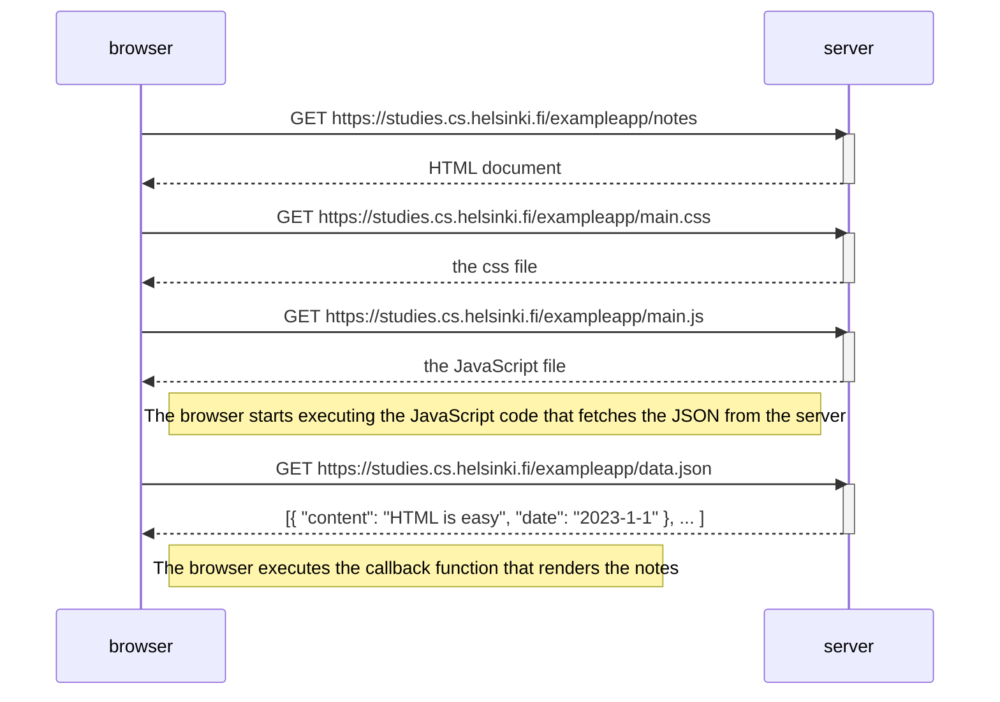

# Fullstack JS boilerplate

Simple boilerplate

## design framework

The sass files from [CUBE CSS workshop](https://github.com/TEJ-Fellowship/cube-css-workshop) are now configured into `client/assets/styles`

The `main.scss` is referenced from `client/index.html` as a regular stylesheet link. Parcel knows to automatically parse the scss to css.

## starting frontend and backend concurrently during dev

Running `npm run dev` will run frontend and backend at the same time so that you have develop all code together

## running in production

- running `npm run build` will build the frontend to `dist` folder
- then running `npm start` will start the backend server with the `dist` folder as `static`
- this will serve the `index.html` file if any requested files are not found.
